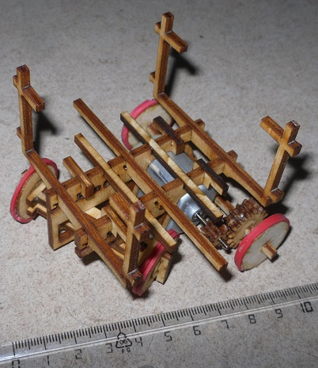

John
----

Ein gibt ein [Youtube Video](https://www.youtube.com/watch?v=KsPsh_-MPLM). 

Ein sehr einfacher Roboter mit einem Motor.
Die Idee kommt von einen Ferngesteuerten Auto, das nur vor-gerade-aus und zurück-lenkend fahren kann.
Auf [dem Video](http://www.youtube.com/watch?v=kYLdbn5RwS8) sieht man, wie ein Roboter das Ziel erreicht, der die selbe Funktionalität hat.

[Bauanleitung](bauanleitung)
