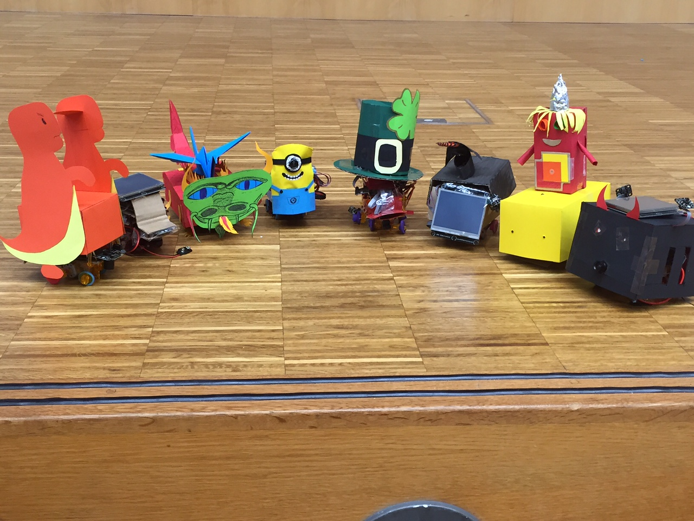
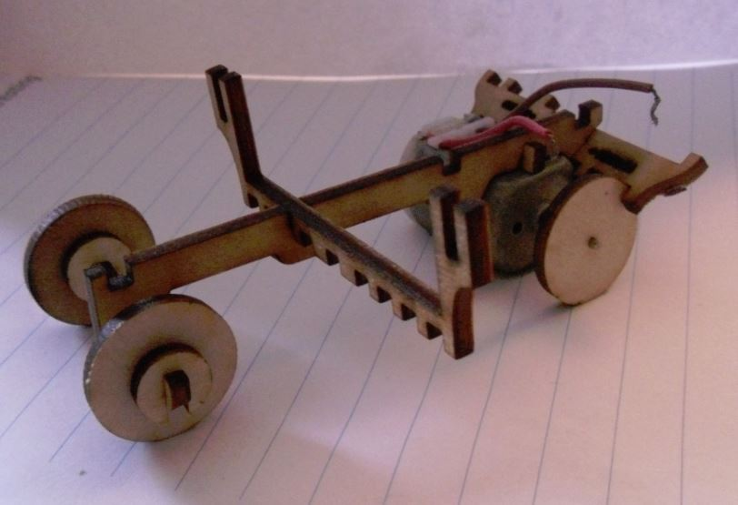

Versionen von John
==================

John V0.4
---------

Diese Version funktioniert gut.  
Die Vorderräder wurden verbessert - sie brechen schlechter ab. Sie stammen von Rödels Hinterrädern.  
Die Antriebsachse ist immernoch eine Schwachstelle. Sie bricht.

Bild vom [HPI Schülercamp 2015](http://www.hpi.de/schueler)

John V0.3
---------

Die Räder sind Holzräder, die leicht rutschen. Wenn man an die Hinterräder Gummi macht, sind diese weit auseinader und machen das Lenken unmöglich für Holzvorderräder. Wenn man alle Räder bereift, dann ist die Kraft auf die Bereifung der Lenkräder zu stark und die Bereifung der Voderderräder wird abgepellt. Wenn man Vorn nur bereift, ist es sehr von der Gewichtsverteilung abhängig, wie gelenkt wird.

Gut ist, die Aufhängung darüber. Sie ist stabil, trägt Arduino und Batterie, zweistufig auch mit Breadboard. Die vielen Stellen zum Gummifestmachen sind nützlich. Die Lenkung lenkt gut. 

Verbesserungsvorschläge:

- Voderradaufhängung verändern siehe Roedel V0.2. Weniger wackelig und breitere Reifen.
- Mabuchi ist ein guter Motor, passt aber nicht ganz rein. Platz für die Kabel schaffen.
- Vielleicht funktioniert eine Version mit Schneckenrad besser, da dann die Hinterräder weiter zusammen sind.

John V0.2
---------

Fährt aber lenkt vielleicht nicht.
[Youtube](https://www.youtube.com/watch?v=KsPsh_-MPLM)

John V0.1
---------

Funktioniert garnicht.

