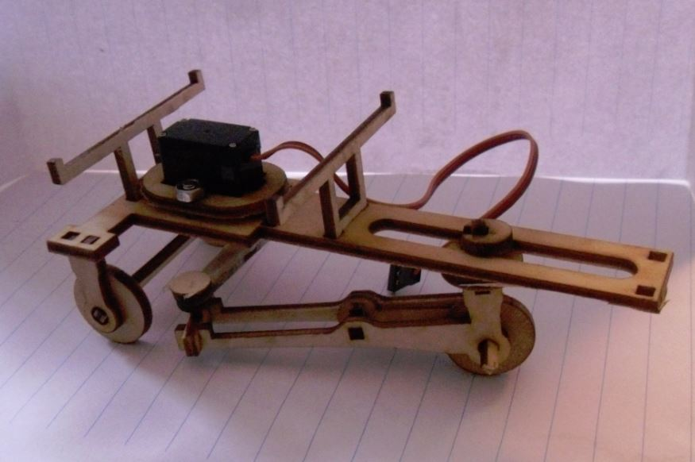

Roedel
------

Ein Roboter, der nur einen Servo als Motor hat. Er kann sich in der Ebene bewegen, indem er das Rad in verschiedene Stellungen bringt. Das Rad dreht sich nur in eine Richtung. Dadurch kann der Roboter sich ziehen oder das Rad bewegen.