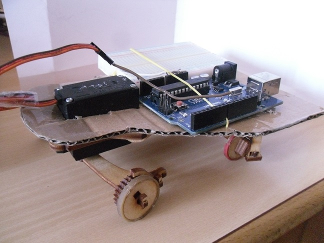

Roedel
------

Ein Roboter, der nur einen Servo als Motor hat. Er kann sich in der Ebene bewegen, indem er die Vorderräder in verschiedene Stellungen bringt. Die Vorderräder drehen sich nur in eine Richtung. Dadurch kann der Roboter sich abwechselnd mit einem Rad ziehen.

Es gibt Videos zur Steuerung mit 

 - [Arduino](http://youtu.be/wDSMWdDKJlY)
 - [Raspberry Pi und WLAN](https://www.youtube.com/watch?v=ziaObK0-GAg&feature=youtu.be)
 - [Android-App von App-Inventor](https://www.youtube.com/watch?v=wF0yfeDUJzY&feature=youtu.be)
 - [Programmierung durch Blockly im Webinterface](https://www.youtube.com/watch?v=NBPCZgiwuP4&feature=youtu.be)

Die Unterordner enthalten mehr Informationen zu den verschiedenen Möglichkeiten.

[Bauanleitung](bauanleitung)