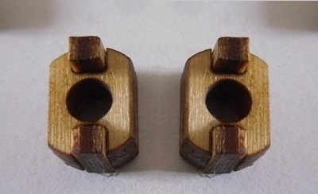

Bauanleitung für Rödel
======================

Vorbereitung
------------

- 1x [Modelcraft RS-2 Servo](../../equipment/motoren/Modelcraft_RS-2.md) oder vergleichbar
- 1x [ausgeschnittene Zeichnung](../roedel.svg) aus Holz, da Acryl zu sehr rutscht und die Räder nicht einrasten
- optimal: Gummi für die Reifen (breite Haushaltsgummis oder Luftballon)

Benötigte Teile für einen Arduino oder Raspberry Pi:

- Draht oder Kabel
- Pappe oder Polisterol für eine Fläche
- Stromversorgung
 	- Arduino
		- 9V Batterie
		- Stecker für die Batterie
		- Stecker für Arduino Uno
	- Raspberry Pi
		- 9V Batterie
		- 5V USB-Power Bank
		- USB-B zu Micro-USB Kabel
		- 1x Anschlusskabel an GPIO-Pin

Werkzeuge:

- 1TL Öl (Feinmechaniköl, Sonnenblumenöl oder Olivenöl)
- Kleber
- ein Messer, wenn der Lasercutter schlecht schneidet

Ausschneiden
------------

3mm dickes Holz ist der Empfohlene Stoff. Acryl ist sehr rutschig. Schneiden dauert ca. 3-4 Minuten.

Beim Rausnehmen können kleine Teile eventuell durch den Lasercutter fallen. Deswegen kann man sie vor dem Anheben mit Klebestreifen rausholen.

Zusammenbauen
-------------

