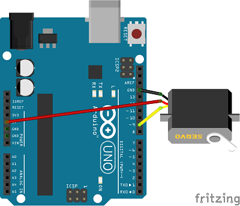
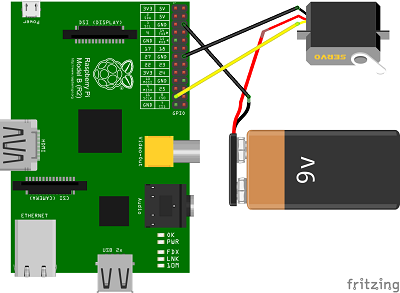

Bauanleitung für Rödel
======================

Vorbereitung
------------

- 1x [Modelcraft RS-2 Servo](../../equipment/motoren/Modelcraft_RS-2.md) oder vergleichbar
- 1x [ausgeschnittene Zeichnung](../roedel.svg) aus Holz, da Acryl zu sehr rutscht und die Räder nicht einrasten
- optimal: Gummi für die Reifen (breite Haushaltsgummis oder Luftballon)

Benötigte Teile für einen Arduino oder Raspberry Pi:

- Draht oder Kabel
- Pappe oder Polisterol für eine Fläche
- Stromversorgung
 	- Arduino
		- 9V Batterie
		- Stecker für die Batterie
		- Stecker für Arduino Uno
	- Raspberry Pi
		- 9V Batterie
		- 5V USB-Power Bank
		- USB-B zu Micro-USB Kabel
		- 1x Anschlusskabel an GPIO-Pin

Werkzeuge:

- 1TL Öl (Feinmechaniköl, Sonnenblumenöl oder Olivenöl)
- Kleber
- ein Messer, wenn der Lasercutter schlecht schneidet

Ausschneiden
------------

3mm dickes Holz ist der empfohlene Stoff. Acryl ist sehr rutschig. Schneiden dauert ca. 3-4 Minuten.

Beim Rausnehmen können kleine Teile eventuell durch den Lasercutter fallen. Deswegen kann man sie vor dem Anheben mit Klebestreifen rausholen.

Zusammenbauen
-------------

  
Die vier Zahnräder paaren, sodass zwei links und zwei rechts drehen, eines mit Kleber beschmieren. Der Kleber darf nicht in die Mitte gelangen, da dort später die Radachse verläuft. (links)  
Dann die Stifte bekleben und in die Räder stecken, sodass sie nur oben rausschauen, nicht unten. (rechts)

  
Ca. 66mm Gummi abschneiden, wenn es zu groß ist. Es geht auch Luftballon. Bei dickem Gumi darauf achten, dass es sich nicht in zwei Richtungen biegt, da das Gummi schon so schlecht am Kleber hängen bleibt und sich dann immer wieder ablösen könnte.

  
Das Gummi kann jetzt am Rad festgeklebt werden. Wenn man dauerhaft Druck darauf ausüben möchte, passt vielleicht ein großer Flaschendeckel oder ein Damestein. Aber auch zurechtgebogene Büroklammern helfen beim Festdrücken. Je nach Dicke und Art des Gummis hält es auch von allein gut am Kleber.

  
Die Radstabilisatoren zusammensetzen. Diese dürfen auch nur auf einer Seite überstehen. Kleber benutzen.

  
Von diesen Radstabilisatoren gibt es zwei.

  
Den Servo in die Halterung stecken. Wierum ist egal. Dann die Verankerung reinstecken und dabei ein wenig Kleber benutzen, wenn der Servo lange drin bleiben soll. Bestimmt hält es auch ohne Kleber.

  
An beiden Seiten die Verankerung reingestecken. Wenn der Servo so rum drin ist, wie im Bild gezeigt, dann fällt der Roboter ohne Gewicht nicht um.

  
Die Beine an den Servohalter stecken. Dabei komt auch Kleber zum Einsatz. Der drehbare Teil des Servos ist dabei unten, genauso wie die Beine, an die später die Räder kommen.

  

  
Die Radstabilisatoren an die Räder kleben.  
Die Räder auf die Radachse stecken.   
Die Radachse an die Beine stecken. Hier muss die Radachse vorsichtig angeklebt werden, damit das Rad nicht festklebt. Man kann auch darüber noch ein Stückchen Holz oder anderes kleben, damit die Achse besser hält.

  

  
Die Zahnräder auf die Räder kleben. Dabei steht nichts mehr über. Versuchen, das Loch in der Mitte von Kleber frei zu halten oder mit einem Stab den Kleber rausbohren.

  
Die Blockadehebel auf die Drehachse Stecken. 

  
Hier sieht man jetzt die kleinen Stecker, die gut verloren gehen.  
Am besten auf den äußeren Rand vom Loch ganz außen einen Tropfen Kleber machen. Da kommt er nicht an den Blockadehebel, der wackeln soll. Dann den Stecker reinstecken. Der Hebel sollte sich bewegen. Wenn Kleber dran gekommen ist, kann man es nochmal versuchen oder nach dem Trocknen ölen.

  
Das Zahnrad draufstecken. Wichtig ist, dass die Zähne gut greifen. Wer in den ersten Schritten die Zahnräder in unterschiedliche Richtungen gemacht hat, sollte jetzt keine Probleme bekommen.

  
Auf hier wieder mit etwas Kleber auf dem Loch außen den Stecker befestigen.

  
Draufstecken. Es empfiehlt sich, den Servo erst auf eine Seite zu drehen und dann die Drehachse draufzustecken. Der Drehwinkel beim ModelCraft-RS2 Servo ist 203°. Somit sollte die Achse 11,5° überdreht sein. 

  
Jetzt kann man sich noch eine Platte ausschneiden und draufkleben. Wenn der Kleber getrocknet ist, können die Räder geölt werden.

Anschließen
-----------

Beim Arduino steckt der Servo am Pin 9, damit die Beispielprgramme funktionieren.  
Bein Raspberry Pi steckt der Servo an GPIO Pin 11, damit die Beispielprogramme funktionieren.

So kann man den Servo anschließen:  

Sollte der Servo zu viel Strom ziehen und der Arduino oder Raspberry Pi ausschalten oder neustarten, braucht der Servo eine eigene Batterie:  

So sieht ein Rödel Roboter aus, der den Servo direkt am Arduino Nano hat:  

