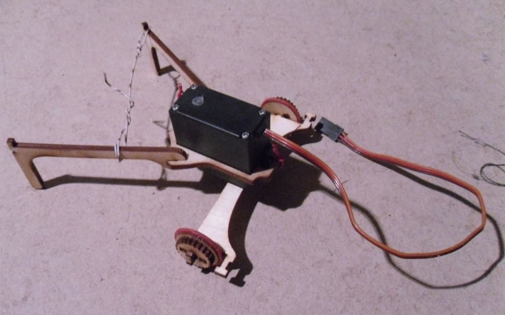

Versionen von Roedel
====================

Roedel V0.2
-----------

Zwei Vorderräder. Für "Modelcraft RS2" Servo.

Roedel V0.1
-----------

Weiß nicht, ob er geht. Für einen kleinen Servo ausgelegt.

