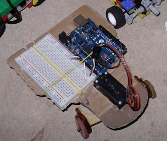

Versionen von Roedel
====================

Roedel v0.2.5
-------------

Durch viel belastung ist die Hinterachse von allen Rödelrobotern gebrochen. Sie ist jetzt durchgängig dick, um Brüche zu vermeiden.

Roedel v0.2.4
-------------

Die Einrastzahnräder wurden mehr angeschrägt, um besseren Halt zu bieten.

Roedel v0.2.3
-------------

Die Schraubenlöcher wurden durch Steckverbinder erssetzt. Jetzt braucht man keine Schrauben mehr.

Roedel v0.2.2
-------------

Die Version funktioniert einigermaßen gut. [Siehe Video.](http://youtu.be/wDSMWdDKJlY)

Roedel V0.2
-----------

Zwei Vorderräder. Für "Modelcraft RS2" Servo. [Video](https://www.youtube.com/watch?v=7x2s_AlgUBw)

Roedel V0.1
-----------

Weiß nicht, ob er geht. Für einen kleinen Servo ausgelegt.

